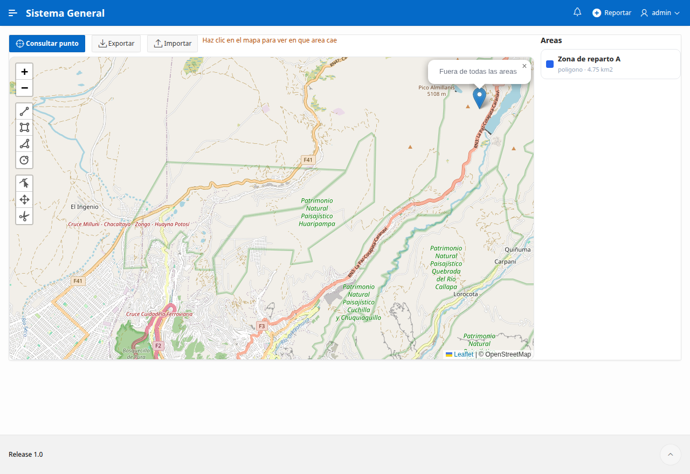
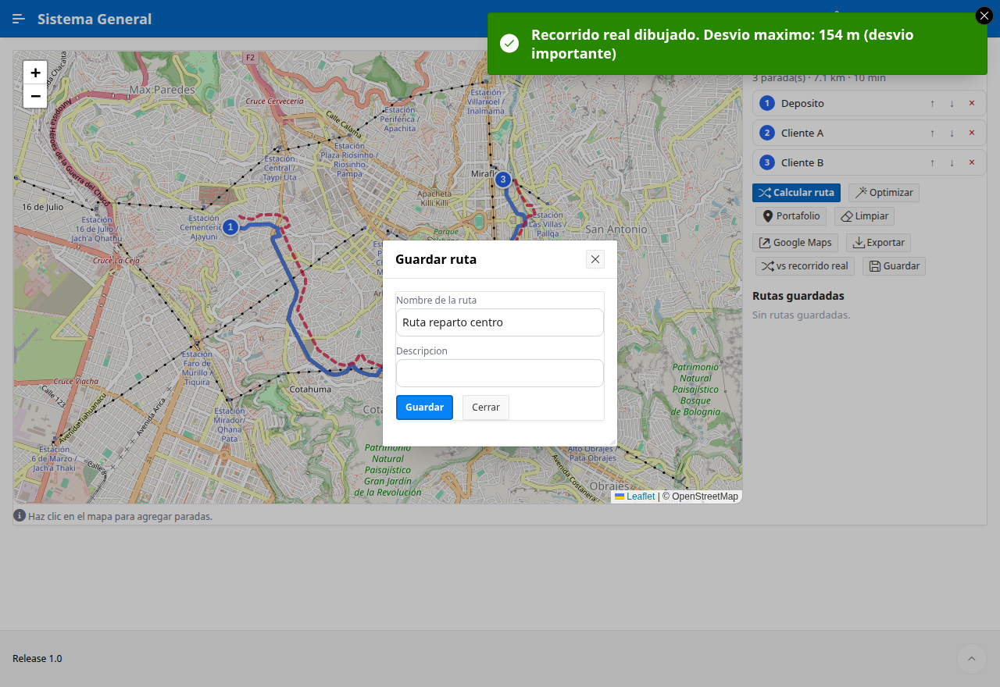

[Español](README.md) | **English**

# Map Kit for Oracle APEX

**Five ready-to-use map tools, built with free software and no paid plugins.**

If you work with [Oracle APEX](https://apex.oracle.com) and ever wanted to add a map to your
application (to locate customers, track attendance by zone, or see your team in real time),
this kit saves you weeks of work. All the code is here, explained step by step.

> Built on APEX with [Leaflet](https://leafletjs.com) and the free maps from
> [OpenStreetMap](https://www.openstreetmap.org). It costs nothing and does not rely on Google Maps.

---

## What's included (5 tools)

### 1. Portfolio map
A map where you pin places (customers, branches, points of interest) grouped by color-coded
category. Click the map to add a point, and click a point to view its details or edit it.

**Use it for:** showing where your customers, stores, or job sites are.

---

### 2. Geofence (presence control by zone)
You define "zones" on the map (a circle around a place). When a person marks their presence,
the system verifies they are **physically inside the zone** and within the allowed schedule.
Ideal for attendance control of field staff.

**Use it for:** confirming that someone actually arrived at a place (a job site, a branch, a
customer's home) before recording their attendance.

---

### 3. Live tracking
A map that shows users **in real time**: their photo (avatar), how fast they are moving, and
in which direction. Each person decides whether to share their location with a button. You can
see each person's recent route.

It also has **automatic alerts**: it notifies you (even with a notification on your phone)
when someone **exceeds a speed** or **arrives at / leaves a place** you defined.

**Use it for:** coordinating field teams (deliveries, technicians, transport) and getting
alerts without staring at the screen.

> The marker moves showing the speed in real time and, when it exceeds the limit, the alert
> pops up on the right.

---

### 4. Sketches and areas
Draw **polygons, lines, circles and rectangles** on the map. It **measures the surface**
(m2, hectares, km2) and **distance**, stores each shape as **GeoJSON** in your database, and
answers a key question: **does this point fall inside an area?** You can also **import and
export GeoJSON**.

**Use it for:** delivery zones, land plots, sales coverage, worksite areas, agriculture.

---

### 5. Routes and navigation
Build a **route with several stops** (by clicking or picking them from the portfolio), compute
the **road path** with distance and estimated time, **optimize the stop order**, and **open it
in Google Maps** to navigate. You can **save** routes, **export** them, and **compare the
planned route against the actual track** (it highlights the deviation).

**Use it for:** deliveries, technician visits, transport, field logistics.

> Road routing uses the free public [OSRM](https://project-osrm.org) service. If it is not
> available, the route automatically falls back to a straight line.

---

## Requirements

To use this kit you need:

| Requirement | Detail |
|-------------|--------|
| **Oracle APEX** | Version 22 or higher. The [free cloud APEX](https://apex.oracle.com) (*Always Free* account) works fine. |
| **Oracle database** | The one that comes with APEX. Nothing extra needed. |
| **Internet connection** | Maps load from `unpkg.com` (the Leaflet library) and `tile.openstreetmap.org` (the map tiles). Both are free and public. |
| **HTTPS** | Required so the browser allows using location (cloud APEX already runs on HTTPS). |
| **A users table** | If your app doesn't have one yet, the file `sql/00_requisitos.sql` creates a minimal one so everything works. |

> You don't need a credit card, a Google Maps key, or to buy any plugin.

---

## Installation (step by step)

### Step 1 - Load the code into the database
Open **SQL Workshop > SQL Scripts** in your APEX (or SQL Developer) and run, **in order**,
the files in the [`sql/`](sql/) folder:

1. `00_requisitos.sql` - the shared toolbox *(skip it if your app already has users)*.
2. The module you want:
   - Portfolio map: `10_...` and `11_...`
   - Geofence: `20_...` and `21_...`
   - Live tracking: `30_...`, `31_...`, `32_...` (and optionally `33_...` for push notifications).
   - Sketches and areas: `40_...` and `41_...`
   - Routes and navigation: `50_...` and `51_...`

Every file can be re-run without breaking anything (they are idempotent).

### Step 2 - Create the map page
Follow the guide [`paginas/COMO-CREAR-LA-PAGINA.md`](paginas/COMO-CREAR-LA-PAGINA.md)
(in Spanish). In short: create a blank page, paste the JavaScript from
[`paginas/js/`](paginas/js/), and add a small process named `AJAX`. It takes 5 minutes.

### Step 3 - Run
Press **Run** and enjoy your map.

---

## FAQ

**Is it really free?**
Yes. Leaflet and OpenStreetMap are open source. Oracle APEX has a free tier.

**Does it work on mobile?**
Yes, the maps are designed to look good on a phone.

**Does it track people without them knowing?**
No. In live tracking, each person chooses to share their location with a button, and the
browser always asks for permission. Use it with consent and responsibly.

**Can I change the marker design / colors?**
Yes, everything is in the `.js` files as plain text you can edit.

---

## License

[MIT](LICENSE) - you may use, modify, and share it freely, including in commercial projects.
If it helps you, a star on the repo is appreciated.

---

*Built with Oracle APEX + Leaflet + OpenStreetMap. Made to share with the community.*
