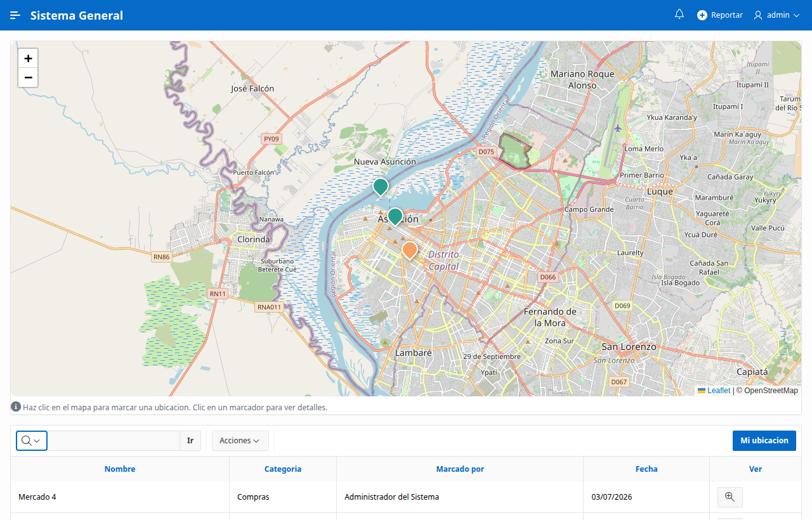
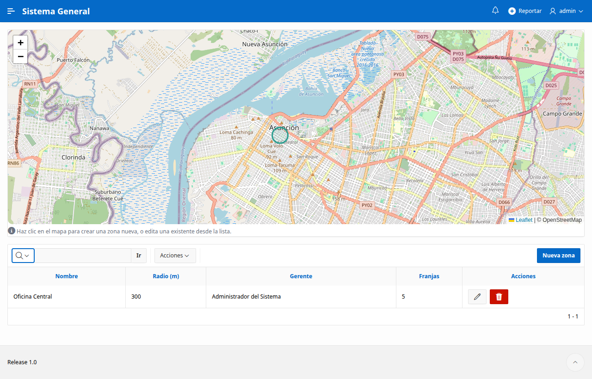
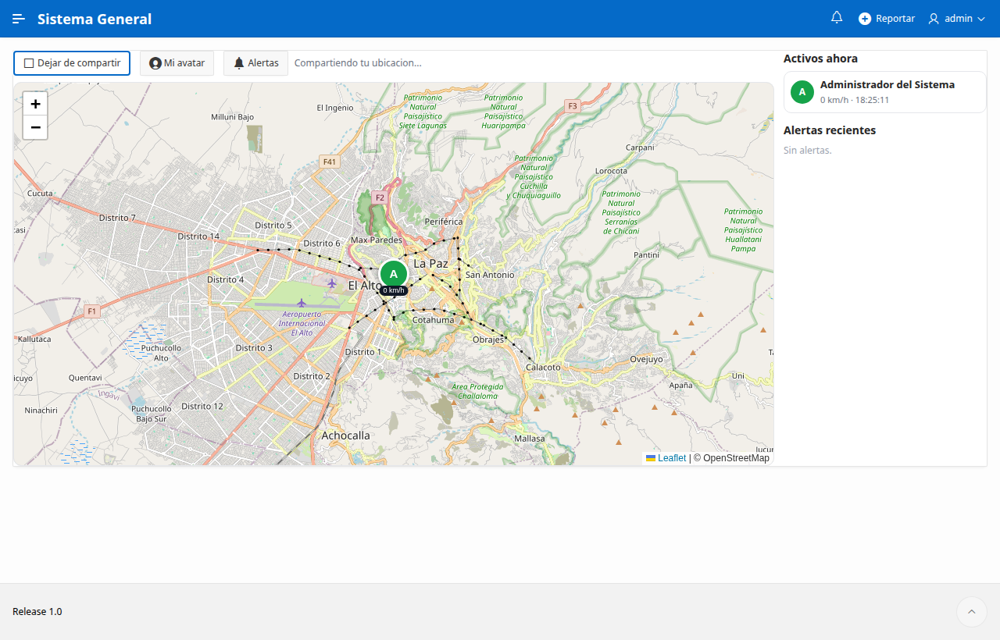
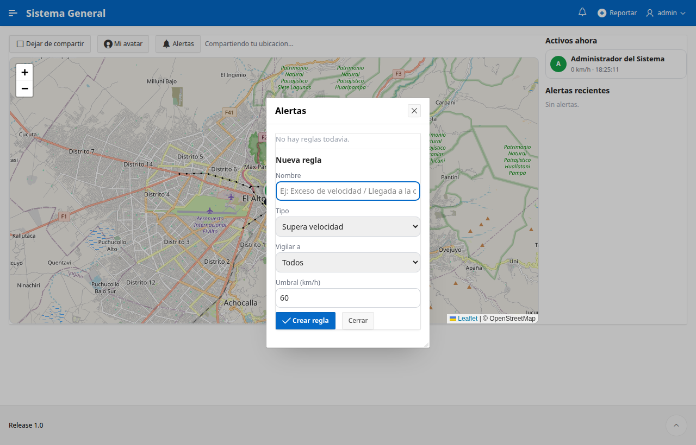

**Español** | [English](README.en.md)

# Kit de Mapas para Oracle APEX

**Tres mapas listos para usar, hechos con software libre y sin plugins de pago.**

Si trabajas con [Oracle APEX](https://apex.oracle.com) y alguna vez quisiste poner un mapa
en tu aplicación (para ubicar clientes, controlar asistencia por zona o ver a tu equipo en
tiempo real), este kit te ahorra semanas de trabajo. Todo el código está aquí, explicado
paso a paso y en español.

> Hecho sobre APEX con [Leaflet](https://leafletjs.com) y los mapas gratuitos de
> [OpenStreetMap](https://www.openstreetmap.org). No cuesta nada y no depende de Google Maps.

---

## Qué incluye (3 mapas)

### 1. Mapa de portafolio
Un mapa donde marcas lugares (clientes, sucursales, puntos de interés) clasificados por
categoría con colores. Haces clic en el mapa para agregar un punto y clic en un punto para
ver su ficha o editarlo.

**Sirve para:** mostrar dónde están tus clientes, tus locales, tus obras, etc.

---

### 2. Geocerca (control de presencia por zona)
Defines "zonas" en el mapa (un círculo alrededor de un lugar). Cuando una persona marca su
presencia, el sistema verifica que **esté físicamente dentro de la zona** y en el horario
permitido. Ideal para control de asistencia de personal en terreno.

**Sirve para:** confirmar que alguien realmente llegó a un lugar (una obra, una sucursal,
la casa de un cliente) antes de registrar su asistencia.

---

### 3. Monitoreo en vivo
Un mapa que muestra a los usuarios **en tiempo real**: su foto (avatar), a qué velocidad se
mueven y hacia dónde. Cada persona decide si comparte su ubicación con un botón. Puedes ver
el recorrido reciente de cada uno.

Además tiene **alertas automáticas**: te avisa (incluso con una notificación en el celular)
cuando alguien **supera una velocidad** o **llega/sale de un lugar** que tú definiste.

**Sirve para:** coordinar equipos en la calle (repartos, técnicos, transporte) y recibir
avisos sin estar mirando la pantalla.

> El marcador se mueve mostrando la velocidad en tiempo real y, al superar el límite,
> salta la alerta a la derecha.

---

## Requisitos

Para usar este kit necesitas:

| Requisito | Detalle |
|-----------|---------|
| **Oracle APEX** | Versión 22 o superior. Sirve el [APEX gratuito en la nube](https://apex.oracle.com/es/) (cuenta *Always Free*). |
| **Base de datos Oracle** | La que viene con APEX. No hace falta nada extra. |
| **Conexión a internet** | Los mapas se cargan desde `unpkg.com` (la librería Leaflet) y `tile.openstreetmap.org` (las imágenes del mapa). Ambos son gratuitos y públicos. |
| **HTTPS** | Necesario para que el navegador permita usar la ubicación (el APEX de la nube ya viene con HTTPS). |
| **Una tabla de usuarios** | Si tu app aún no tiene una, el archivo `sql/00_requisitos.sql` crea una mínima para que todo funcione. |

> No necesitas tarjeta de crédito, ni clave de Google Maps, ni comprar plugins.

---

## Instalación (paso a paso)

### Paso 1 - Cargar el código en la base de datos
Abre **SQL Workshop > SQL Scripts** en tu APEX (o SQL Developer) y ejecuta, **en orden**,
los archivos de la carpeta [`sql/`](sql/):

1. `00_requisitos.sql` - la caja de herramientas común *(sáltalo si tu app ya tiene usuarios)*.
2. El módulo que quieras:
   - Mapa de portafolio: `10_...` y `11_...`
   - Geocerca: `20_...` y `21_...`
   - Monitoreo en vivo: `30_...`, `31_...`, `32_...` (y opcionalmente `33_...` para las notificaciones push).

Cada archivo se puede volver a ejecutar sin romper nada (son "idempotentes").

### Paso 2 - Crear la página del mapa
Sigue la guía [`paginas/COMO-CREAR-LA-PAGINA.md`](paginas/COMO-CREAR-LA-PAGINA.md).
En resumen: creas una página en blanco, pegas el JavaScript de [`paginas/js/`](paginas/js/)
y agregas un pequeño proceso que se llama `AJAX`. Son 5 minutos.

### Paso 3 - Ejecutar
Pulsa **Run** y disfruta tu mapa.

---

## Preguntas frecuentes

**¿Es realmente gratis?**
Sí. Leaflet y OpenStreetMap son de código abierto. Oracle APEX tiene una capa gratuita.

**¿Funciona en celular?**
Sí, los mapas están pensados para verse bien en el teléfono.

**¿Rastrea a la gente sin que lo sepan?**
No. En el monitoreo cada persona decide compartir su ubicación pulsando un botón, y el
navegador siempre pide permiso. Úsalo con consentimiento y de forma responsable.

**¿Puedo cambiar el diseño de los marcadores / colores?**
Sí, todo está en los archivos `.js` y es texto plano que puedes editar.

---

## Licencia

[MIT](LICENSE) - puedes usarlo, modificarlo y compartirlo libremente, incluso en proyectos
comerciales. Si te sirve, una estrella en el repo se agradece.

---

*Construido con Oracle APEX + Leaflet + OpenStreetMap. Hecho para compartir con la comunidad.*
